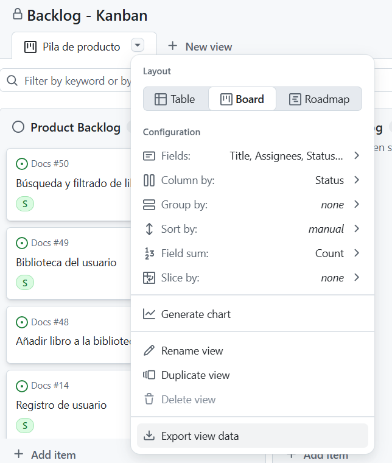

Generador automatico de un fichero .csv con los issues del tablero del repositorio.

Para ejecutar: 
1. Asegurate de haber actualizado el fichero "Backlog - Kanban - Pila de producto.tsv"
        - Para ello descarga el tsv desde el tablero:
        
2. py main.py
3. Desde Excel -> Datos -> Leer CSV.